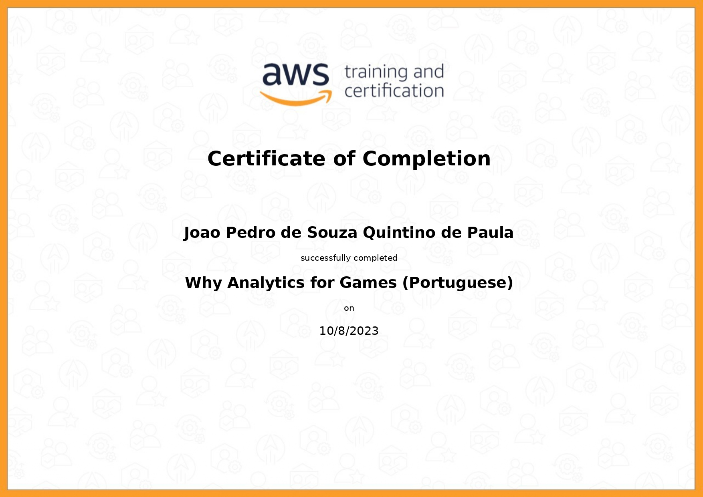
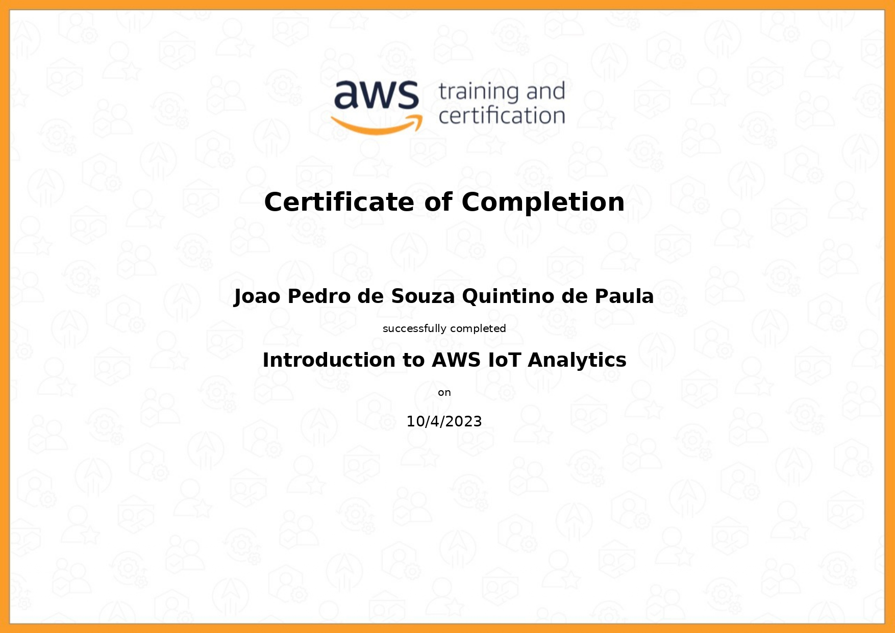

# Exercícios

Sprint sem exercicios.

# Evidências

O processo de estudos foi elaborado com base na minha experiência adquirida com o tempo e com as ferramentas abordadas nos cursos.

# Certificados

